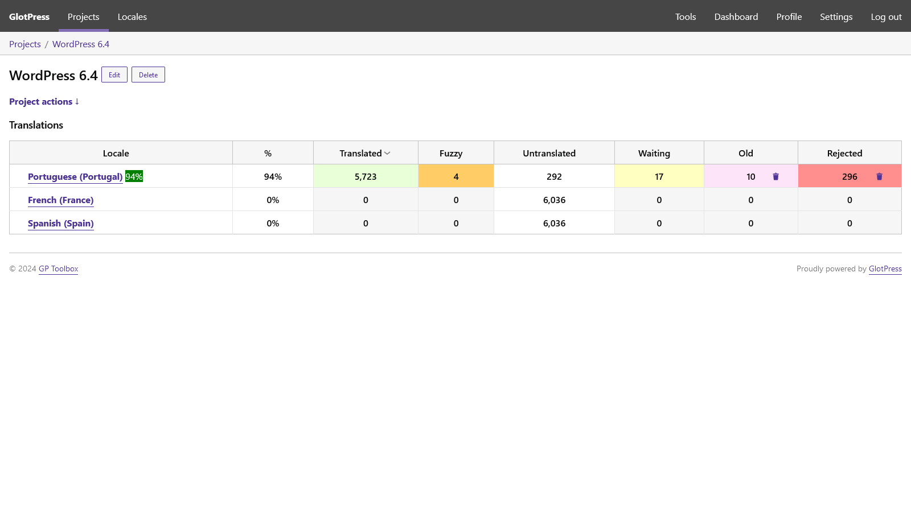
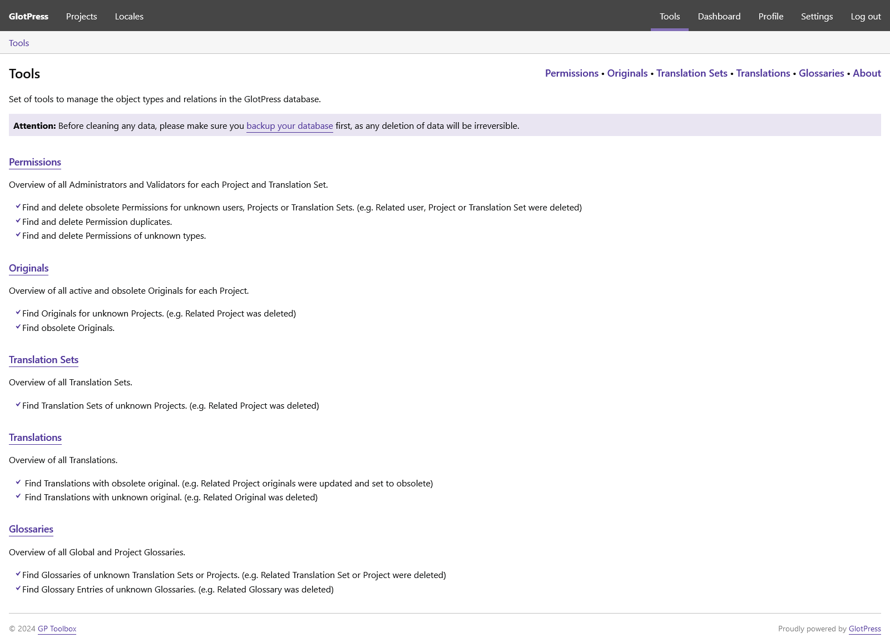
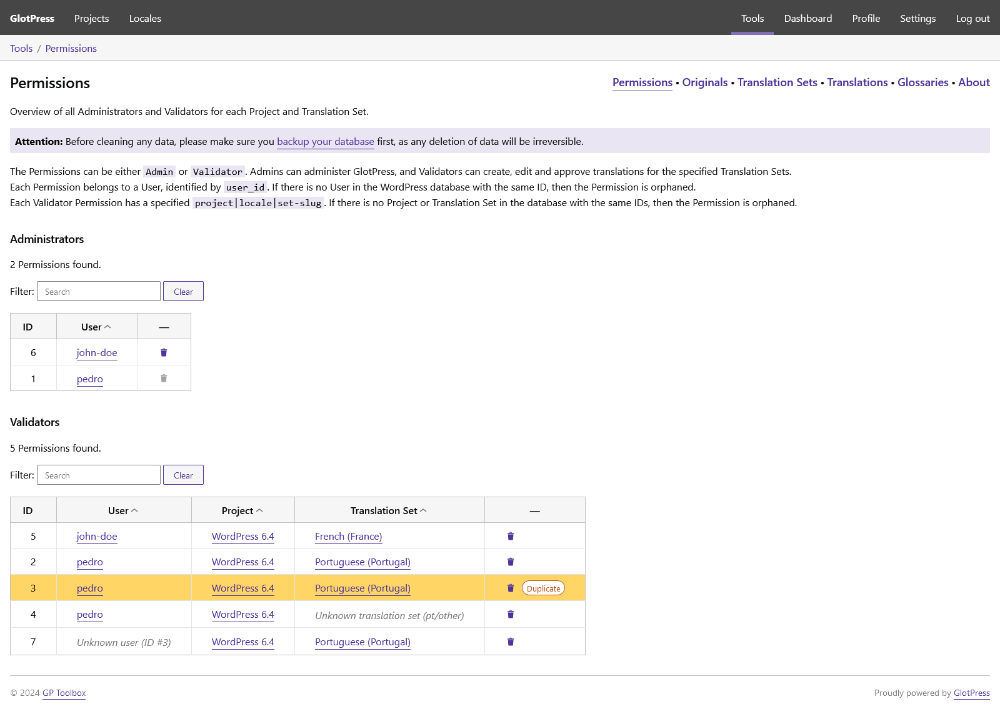
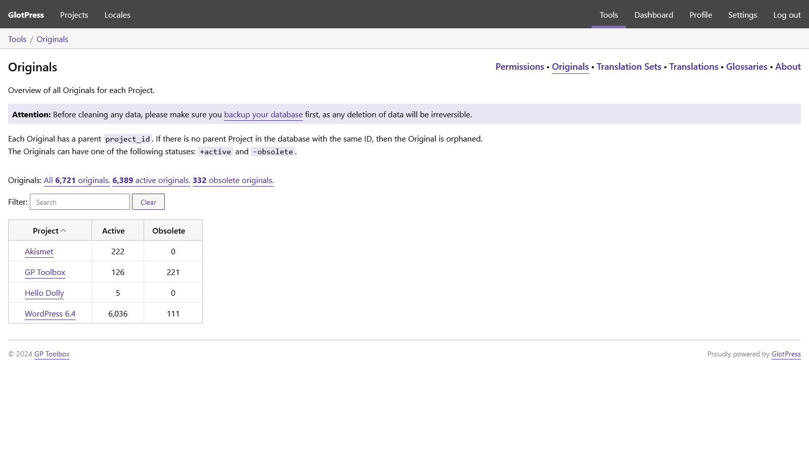
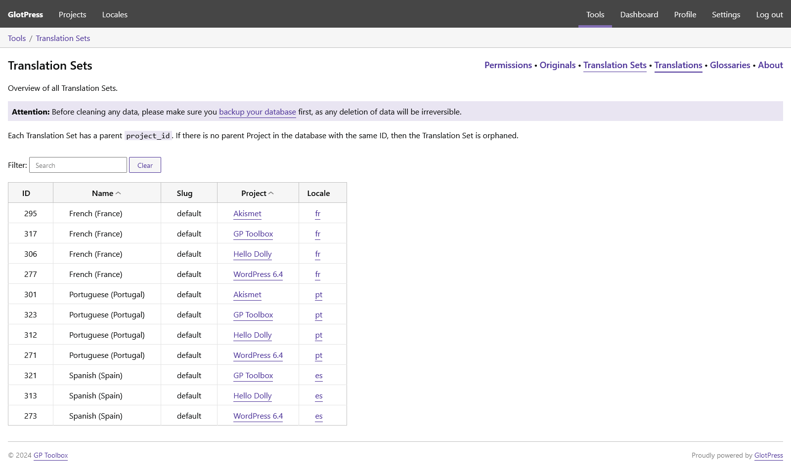
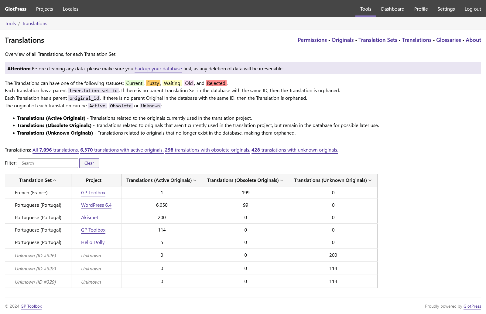
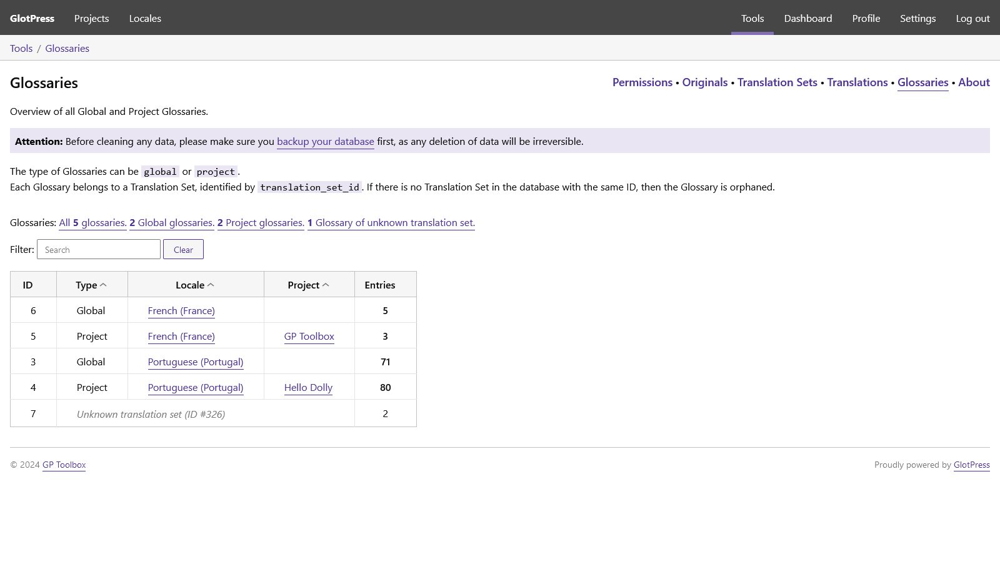

# GP Project Icon

Add icons to your GlotPress projects.

## Description

This GlotPress plugin allows you to add icons to your projects.

Up to GlotPress v4.0.1 the templates 'project.php' and 'projects.php' don't have the necessary hooks to easily add the icons on server side.

For now the icons are added on the frontend with JavaScript.

If the PR [Add action hooks and filters to Projects and Project templates](https://github.com/GlotPress/GlotPress/pull/1864) is merged, then the JS is no longer needed and the template customization will be done the right way.

The plugin uses `gp_meta` with the meta key `project_icon` to store the ID of the media library attachment, for each object of type `project` with a corresponding ID.

## Features

* GlotPress projects page:
  * Icons on the left of the project names.
* GlotPress project page:
  * Header icon above the project title.
  * Icons on the left of the sub-project names.
* GlotPress project edit/new form:
  * Media file select field to choose an image from the media library.

## Known issues

* Currently, GlotPress still does not delete meta when deleting a project, leading to orphaned meta.
* GlotPress does not clone the meta when branching a project, so any cloned projects do not inherit its icon.

## Requirements

* GlotPress v4.0.

## Frequently Asked Questions

### Can I contribute to this plugin?

Sure! You are welcome to report any issues or add feature suggestions on the [GitHub repository](https://github.com/pedro-mendonca/GP-Project-Icon).

## Screenshots

1. Projects page with added icons

   

2. Project page with header icon and sub-project icons

   

3. Project page with header icon and translation sets

   

4. Project page with header icon and sub-project icons

   

5. Project edit/new form with no icon selected

   

6. Project edit/new form selecting an icon from the media library

   

7. Project edit/new form with icon selected

   

## Changelog

### Unreleased

* Tested up to WP 6.7.
* Include minified assets maps.
* Add prefixes for supported browserslist.

### 1.0.0

* Initial release.
* Add project icons to GlotPress Projects page.
* Add project header icon to GlotPress Project page.
* Add sub-project icons to GlotPress Project page.
* Add media file select field to the Project edit/new form.
* Delete project icon meta when deleting a project.
